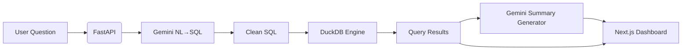

#  Natural Language SQL Agent (FastAPI + Gemini + DuckDB + Next.js)

A full-stack **analytics assistant** that converts plain English questions into SQL, executes them on **DuckDB**, and returns clean tabular results, auto-generated natural-language summaries, and lightweight visualizations.

Designed for high-quality data exploration **without writing SQL**.

##  Features

| Category | Description |
| :--- | :--- |
| ** NL → SQL Generation** | Uses **Gemini 2.5 Flash** to translate natural language into SQL. |
| ** Execution Engine** | Runs generated SQL safely on **DuckDB** with join support. |
| ** Frontend Dashboard** | **Next.js** app showing results, tables, bar-charts & SQL query block. |
| ** Natural Language Insights** | **Gemini 2.5 Pro** summarizes SQL results into human-friendly insights. |
| ** Chat Interface** | Full conversational chat with message bubbles and loading states. |
| ** CORS Enabled** | Ready for local dev or multi-service integration. |
| ** SQL Sanitization** | Removes markdown fences & ensures **SELECT-only** execution. |
| ** Debug Mode (/ask-raw)** | Second endpoint to inspect exact generated SQL. |

---

##  Architecture Overview

The system follows an end-to-end prompt → SQL → data → insights pipeline.




# Backend (FastAPI + Gemini + DuckDB)
## Endpoints

| Endpoint | Method | Description |
|-----------|---------|-------------|
| `/health` | GET | Checks liveliness of the server |
| `/ask` | POST | NL question → SQL → execute → return results + summary |
| `/ask-raw` | POST | Debug endpoint: returns generated SQL without filtering |


### Example Request (/ask)
```curl -X POST http://127.0.0.1:8000/ask \
  -H "Content-Type: application/json" \
  -d "{\"query\": \"top 10 sellers by total orders\"}"
```

### Example Response
```
{
  "sql": "SELECT seller_id, COUNT(*) ...",
  "rows": [...],
  "columns": [...],
  "rowcount": 10,
  "summary": "This query shows the top sellers..."
}
```

## Backend Setup
### Install dependencies
```
pip install -r requirements.txt
```
### Set env variables
Create .env:
```
GEMINI_API_KEY=your_key
DUCKDB_PATH=olist.duckdb
```

### Run server
```
uvicorn main:app --reload --port 8000
```

## Frontend (Next.js Analytics Chat UI)
### Features

| Feature | Description |
|-----------|-------------|
|  **Chat Sidebar** | Conversation-style interface with user + assistant bubbles |
|  **Query Results Panel** | Shows row count, table, and data |
|  **Inline Visualization** |Auto bar-chart for top 10 results|
|  **Insight Summary** | Clean natural-language explanation |
|  **Error Handling** | Proper UI fallback during failures |


### Running the Next.js frontend
```
npm install
npm run dev
```

The app runs on:
```
http://localhost:3000/chat
```

## Project Structure
/backend
    main.py              ← FastAPI + NL→SQL engine
    .env
    olist.duckdb         ← DuckDB analytics dataset

/frontend
    app/chat/page.tsx    ← Main chat dashboard
    components/ChatSidebar.tsx
    styles, libs, hooks...


## How NL → SQL → Insights Works
### 1. Gemini (Flash) converts question → SQL

Your query:
```
“List top 10 sellers”
```
Becomes:
```
SELECT seller_id, COUNT(*) AS total_orders
FROM order_items
GROUP BY seller_id
ORDER BY total_orders DESC
LIMIT 10
```

### 2. SQL is cleaned (no ``` fences, prefixes, etc.)
### 3. DuckDB executes query safely

Only SELECT queries allowed.

### 4. Gemini (Pro) generates a business-summary

E.g.:

"The top 10 sellers handle between 1,000–1,800 orders, with the leading seller ahead by…”

### 5. Next.js displays all of it beautifully.
 Sample Output (Frontend)


### Supports any DuckDB-joinable question
